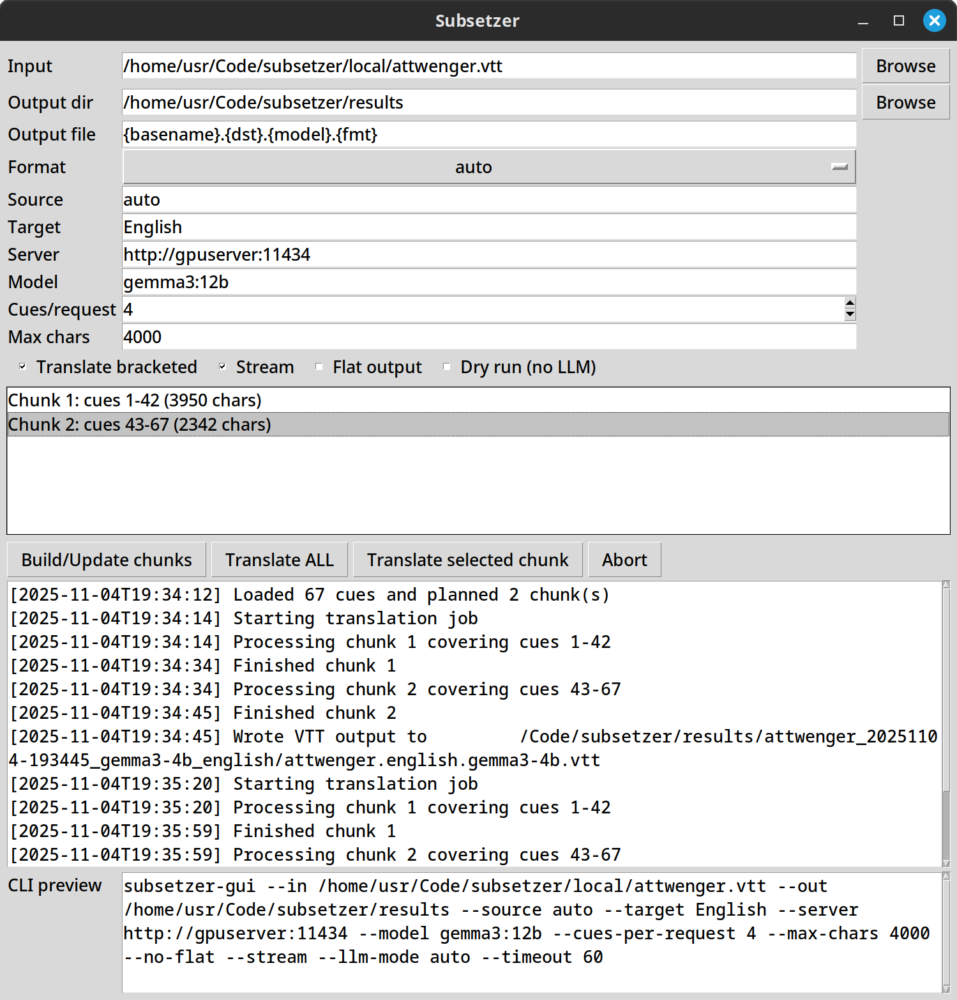

# Subsetzer


Local-first subtitle translation toolkit that talks to an Ollama-compatible LLM.  
This repository houses both the CLI package (`subsetzer`) and the Tk-based GUI wrapper (`subsetzer-gui`).  
Current version: **0.1.2**.

## Key Features
- Translate `.srt`, `.vtt`, and `.tsv` subtitle files via models served by Ollama or compatible APIs.
- Preserve bracketed/timed markup and keep cue boundaries intact, even when a translation spans multiple lines.
- Plan work in configurable chunks to control request size and batching.
- Export to SRT, VTT (with NOTE block describing the run), or TSV with consistent naming templates.
- Choose between CLI automation or the desktop GUI, sharing the same core engine.

## Packages
| Package | Description | Entry Point |
|---------|-------------|-------------|
| `packages/subsetzer` | Core translation engine + CLI | `subsetzer` |
| `packages/subsetzer-gui` | Tk wrapper around the CLI workflow | `subsetzer-gui` |

Each package is built and released independently, but they live together so changes to the engine and GUI stay in sync.

## Installation
### From PyPI (recommended)
Install the latest published wheels straight from PyPI:

```bash
pipx install subsetzer          # CLI only
pipx install subsetzer-gui      # GUI (pulls in subsetzer)
```
Upgrade at any time with `pipx upgrade subsetzer subsetzer-gui`.

### From a local checkout (development builds)
When testing unpublished commits, build the wheels locally and install from disk:

```bash
# 1. Build wheels
python -m venv .venv
source .venv/bin/activate
python -m pip install --upgrade pip build
python -m build packages/subsetzer
python -m build packages/subsetzer-gui

# 2. Install with pipx (adds commands to ~/.local/bin)
pipx install --force packages/subsetzer/dist/subsetzer-0.1.2-py3-none-any.whl
pipx install --force packages/subsetzer-gui/dist/subsetzer_gui-0.1.2-py3-none-any.whl \
  --pip-args="--no-index --find-links=$(pwd)/packages/subsetzer/dist --find-links=$(pwd)/packages/subsetzer-gui/dist"
```

### Editable installs for development
```bash
python -m venv .venv
source .venv/bin/activate
pip install -e packages/subsetzer
pip install -e packages/subsetzer-gui
```

## Quickstart
1. Copy `.env.example` to `.env` and adjust the Ollama server URL/model if needed.
2. Run a translation from the CLI:
   ```bash
   subsetzer --in path/to/source.vtt --out ./outputs --target "German"
   ```
3. Or launch the GUI:
   ```bash
   subsetzer-gui
   ```
   Pick the input file, output directory, adjust options, then click **Build/Update chunks** followed by **Translate ALL**.

Outputs are written to the chosen directory; VTT exports include a NOTE block capturing the model and timestamp.



## Configuration
The CLI and GUI honour `SUBSETZER_*` environment variables. Populate `.env` and `source` it before running:

```
SUBSETZER_LLM_SERVER=http://127.0.0.1:11434
SUBSETZER_LLM_MODEL=gemma3:12b
SUBSETZER_LLM_MODE=auto
SUBSETZER_STREAM=true
SUBSETZER_HTTP_TIMEOUT=60
SUBSETZER_CUES_PER_REQUEST=4
```

Legacy `HOMEDOC_*` names are still accepted for compatibility.

## Usage Details
- **CLI**: batch translation flags (`--cues-per-request`, `--max-chars`), output templating, retries, logging, and environment variables are documented in [USAGE.md](USAGE.md#cli-subsetzer).
- **GUI**: step-by-step walkthrough, screenshot, and tips live in [USAGE.md](USAGE.md#gui-subsetzer-gui).
- **Outputs & troubleshooting**: see [USAGE.md](USAGE.md#outputs).

## Development
```bash
source .venv/bin/activate
# install dev dependencies
pip install -e packages/subsetzer -e packages/subsetzer-gui
pip install pytest
```

- Run CLI in-place: `PYTHONPATH=packages/subsetzer/src python -m subsetzer.cli …`
- Launch GUI in-place: `PYTHONPATH=packages/subsetzer/src:packages/subsetzer-gui/src python -m subsetzer_gui.app`
- Build wheels: `python -m build packages/subsetzer` and `python -m build packages/subsetzer-gui`

## Testing
```
source .venv/bin/activate
PYTHONPATH=packages/subsetzer/src python -m pytest packages/subsetzer/tests
PYTHONPATH=packages/subsetzer/src:packages/subsetzer-gui/src python -m pytest packages/subsetzer-gui/tests
```

## Releases
GitHub Actions publishes tagged releases to PyPI:
- Tag `subsetzer-vX.Y.Z` to publish the CLI package.
- Tag `subsetzer-gui-vX.Y.Z` to publish the GUI.

Ensure wheels are built and verified locally (`python -m build …`) before tagging.

## Repository Layout
```
.
├── packages/
│   ├── subsetzer/        # Core CLI package (stdlib-only)
│   └── subsetzer-gui/    # Tk GUI wrapper
├── outputs/              # Sample translation runs (ignored by git)
├── local/                # Local sandbox assets (ignored)
├── .github/workflows/    # Release automation
└── README.md
```

## License
Both packages are licensed under the GPL-3.0-or-later; see `packages/subsetzer/LICENSE` and `packages/subsetzer-gui/LICENSE`.
